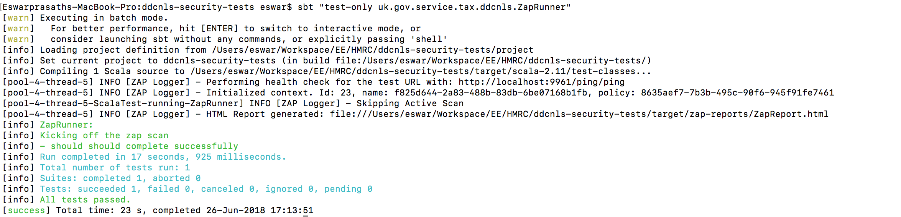

# zap-automation  [  ](https://bintray.com/hmrc/releases/zap-automation/_latestVersion)

This scala library is built for use in a [Scalatest](http://www.scalatest.org/) Suite, and provides an abstraction above the [OWASP ZAP API](https://www.owasp.org/index.php/OWASP_Zed_Attack_Proxy_Project) which allows for simple configurable execution of spider and active scans. The zap-automation library also produces a report summarising the alerts captured during scans, and can be tuned to fail your test run depending on the severity of the vulnerabilities found.

## Configuring a test to use zap-automation
The below step-by-step guide assumes a running OWASP ZAP instance has already proxied traffic to build the context with which to launch an attack scan.  Visit the following pages for help on how to achieve this with an existing WebDriver journey test suite:
- [Starting OWASP ZAP](https://github.com/hmrc/zap-automation/wiki/Starting-OWASP-ZAP-for-use-with-zap-automation)
- [Proxying your Tests via ZAP](https://github.com/hmrc/zap-automation/wiki/Configure-Tests-to-proxy-via-OWASP-ZAP)

### 1. Update your sbt build
In your `build.sbt` file, add the following:

```scala
resolvers += Resolver.bintrayRepo("hmrc", "releases")

libraryDependencies += "uk.gov.hmrc" %% "zap-automation" % "x.x.x" % "test"
```
Replace `x.x.x` with a valid zap-automation version [  ](https://bintray.com/hmrc/releases/zap-automation/_latestVersion)

### 2. Configure logger
The library uses SLF4J for logging purposes. The binding used is `slf4j-api`. If your test suite already has 
a logger implemented, you will see the below warning:

```SLF4J: Class path contains multiple SLF4J bindings.```

This may result in the zap tests running at `debug` log level. 

To fix this, exclude zap-automation's SLF4J dependency in SBT: 

```scala
 "uk.gov.hmrc" %% "zap-automation" % "x.x.x % "test" exclude( "org.slf4j","slf4j-api")
```
If your test suite uses `logback-classic` as the SLF4J binding, then you will need to pass the relevant config to the ZAP test.  For example:
```scala
sbt -Dlogback.configurationFile=logback.xml 'testOnly uk.gov.hmrc.test.ui.cucumber.utils.ZAPRunner'
```
Not passing the config file would result in zap-automation logging in `debug` level.

Alternatively you could remove your existing logger dependencies and rely on the logger dependencies from zap-automation library. 

### 3. Create the zap-automation configuration
In your test suite's `application.conf` create a `zap-automation-config` configuration object.  See the [default configuration](src/main/resources/reference.conf) file for detail on each configuration option.

An simple example can be found [here](examples/singleConfigExample/resources/singleConfigExampleApplication.conf).

You can also make use of the functionality available via [typesafe configuration](https://github.com/lightbend/config) if you would like to implement multiple security tests as part of the same test suite.  See example [here](examples/multipleConfigExample/resources/multipleConfigExampleApplication.conf).

### 4. Create the test
Create a test run in your test suite by extending the ZapTest trait of the zap-automation library. The test **must** extend one of ScalaTest's [testing styles](http://www.scalatest.org/user_guide/selecting_a_style).

The test **must** also override [ZapConfiguration](src/main/scala/uk/gov/hmrc/zap/config/ZapConfiguration.scala) and call triggerZapScan().

See example [here](examples/singleConfigExample/SingleConfigExampleRunner.scala).

### 5. Execute the test
Execute the attack scans with sbt using test created in the previous step.  For example, if you created a test named `utils.support.ZapRunner` then the following command should work:

```sbt "testOnly utils.Support.ZapRunner"```

The output of a successful run will look something like this:


## Reading the output of the test?
A HTML report is created at `target/zap-reports/ZapReport.html` irrespective of whether or not vulnerabilities were found.

The report contains the following sections:
- **Scanners not enabled**: List of required scanners that are not installed/enabled in Zap 
- **Summary of Alerts**: a summary of the vulnerabilities found during the scan
- **Summary of Scans**: which of the scans executed (passive/spider/active)
- **Failure Threshold**: the configured failure threshold
- **Alert Details**: detail on each vulnerability/alert recorded

The below table provides a description of each Alert detail:


| Key | Description |
| --- | --- |
| Low (Medium)  | Low is the Risk Code  and Medium is the Confidence Level. Risk Code is the risk of each type of vulnerability found. Confidence represents ZAP's "sureness" about the finding.|
| URL      | The Url in which the alert was identified      |
| Scanner ID | Id of the scanner. The passive and active scanners for your zap installation can be found at http://localhost:11000/HTML/pscan/view/scanners/ and http://localhost:11000/HTML/ascan/view/scanners/       |
| CWE Id | [Common Weakness Enumeration (CWE™) Id](https://cwe.mitre.org/about/faq.html).      |
| Method | HTTP method      |
| Parameter | Parameter used for the test      |
| Evidence | Evidence for the alert      |
| Description | Description of the alert      |
| Solution | Solution for the alert      |
| Reference(s) | Future use      |
| Internal References(s) | Future use      |

## Scanners not enabled
A fresh installation of ZAP does not include all the required scanners. When the available scanners do not match with
the required scanners listed in [reference.conf](src/main/resources/reference.conf), the library logs a `WARN` message 
with the missing scanners' information.

An example:
 ```
 [pool-6-thread-5] WARN [ZAP Logger] - The below required scanners are not enabled. This will affect ZAP results
    [pool-6-thread-5] WARN [ZAP Logger] - 
                 Scanner ID   : 90001
                 Name         : Insecure JSF ViewState
                 Scanner Type : Passive
  ```
                 
This information is also included in the HTML report under `Scanners not enabled`. Including these scanners in ZAP 
setup will address this warning and ensure accurate results.  


## Development
### Run the unit tests for the library
```scala
sbt test
```

### Debugging
The library provides various debug flags for local development of the library.

### Adding new scanners:
The scanners configuration available in [reference.conf](src/main/resources/reference.conf) is used to filter ZAP results. 
If a scanner is not listed in this config, then the alerts for this scanner will not be included in the HTML report. 
Update this configuration when new scanners are added to ZAP. 

### Issues
Please raise any issues or feedback [here](issues/)

## License
This code is open source software licensed under the [Apache 2.0 License]("http://www.apache.org/licenses/LICENSE-2.0.html").
